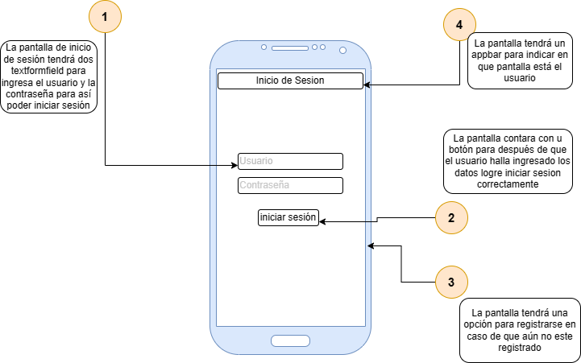
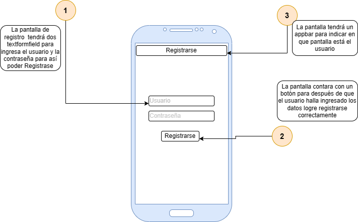
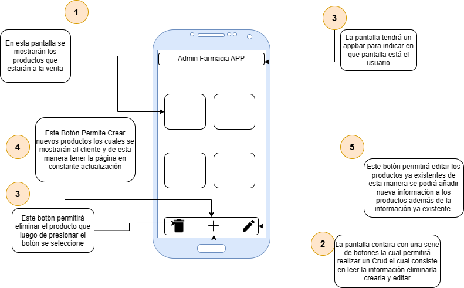

# flutter_application_1

## Pantalla 1

En esta pantalla, se ubican en el centro campos específicos para ingresar el nombre de usuario y la contraseña, lo que facilita la autenticación de usuarios existentes. De manera adicional, en la parte inferior de la pantalla, se ha incorporado un enlace que invita a los nuevos usuarios a registrarse y crear una cuenta. Este diseño se ha concebido pensando en brindar una experiencia de inicio de sesión intuitiva y segura, al mismo tiempo que ofrece la opción de inscribirse a aquellos que aún no tienen una cuenta en el sistema. Además, si el usuario es administrador, se le permitirá acceder a la vista de administrador.

## Pantalla 2

Pantalla de Registro: En esta interfaz, los usuarios encontrarán campos para ingresar su información personal, incluyendo un nombre de usuario y una contraseña. Además, se incluye un botón de 'Registrarse' que les permite enviar su información de manera sencilla. Esta pantalla está diseñada para agilizar el proceso de creación de cuentas, brindando a los nuevos usuarios una experiencia de registro rápida y eficiente.

## Pantalla 3

En esta pantalla, se exhibirá una amplia variedad de productos disponibles para la compra. Estos productos se presentarán en una disposición visualmente atractiva, con imágenes y títulos para identificarlos claramente. Se ofrecerá una vista general que permita a los usuarios explorar y seleccionar los artículos que les interesen. Además, se destacará un botón de 'Comprar' que, al ser activado, brindará a los usuarios la posibilidad de realizar compras en línea de manera rápida y sencilla, simplificando así su experiencia de compra en la plataforma."

"La pantalla de administrador ofrece un conjunto de herramientas clave para gestionar eficazmente la información de productos. En la parte inferior de la pantalla, se presentan una serie de botones que habilitan las operaciones de CRUD (Crear, Leer, Actualizar y Eliminar). Estas operaciones son esenciales para administrar la información de productos de manera eficiente.

- El botón 'Eliminar' permite seleccionar y eliminar productos específicos, lo que facilita la gestión de la base de datos de productos.
- El botón 'Crear' permite agregar nuevos productos al sistema. Estos productos recién creados se mostrarán automáticamente a los clientes, manteniendo la página constantemente actualizada con las últimas incorporaciones.
- El botón 'Editar' permite modificar los detalles de productos existentes, lo que brinda la capacidad de actualizar y añadir nueva información a los productos, enriqueciendo así la información ya existente.

Esta pantalla de administrador garantiza un control completo sobre la información de productos, permitiendo una gestión eficaz y una experiencia de compra mejorada para los usuarios."

### Nota

Para Logearse como admin el usuarioy la contraseña es: 

usuario: admin 

contraseña: admin